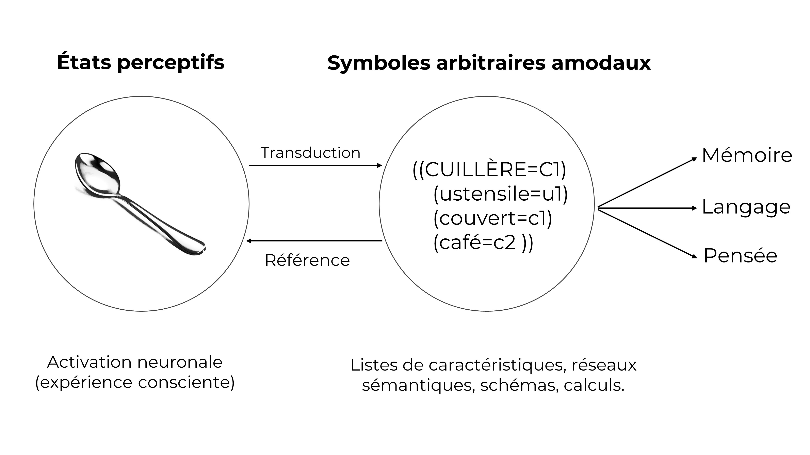
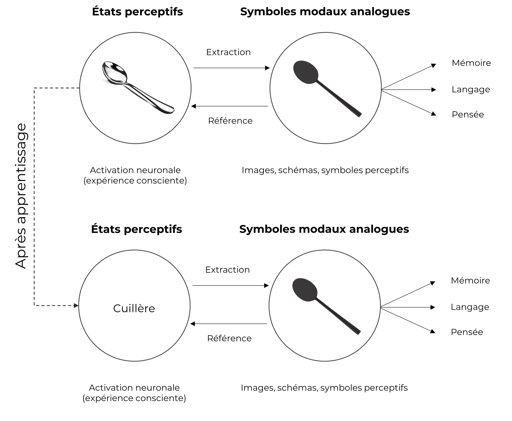

# (PART) Chapitres théoriques {-}

\sloppy
\changechaptercolor{hokusai1}

# Du cognitivisme classique aux théories incarnées du langage {#chap1}

```{r setupCH1, echo = FALSE, message = FALSE, warning = FALSE, results = "hide"}
knitr::opts_chunk$set(
  cache = TRUE, echo = FALSE, warning = FALSE, message = FALSE,
  out.width = "100%",
  fig.pos = "htbp!",
  fig.align = "center"
  )
```

\epigraph{"If, then, one persists in being curious about the 'inner aspect' of behavior and in believing that a man's thoughts are as legitimate objects for scientific study as his movements; if on the other hand, one realizes that it is through his movements that man takes his place in the rest of the order of nature, then the proper outcome of this twofold interest is an attempt to show that the whole of the inner life is correlated with and dependent upon bodily movement."}{Washburn, M. F. (1916, p.xiii)}

\initial{C}ommençons par un exemple. Au rythme des mouvements balistiques linéaires - allant de la gauche vers la droite - que vos yeux réalisent en parcourant ces lignes, vous êtes en train de réaliser une activité d’apparence simple mais dépendante de nombreux processus complexes : la lecture. Chaque mot – cet ensemble de taches noires qui se détachent du fond blanc – projeté sur votre rétine se verra associé à un concept, à une représentation porteuse de sens. Par « représentation porteuse de sens », nous faisons référence ici au résultat du processus (ou de l’ensemble de processus) par le(s)quel(s) un mot se verra assigné à une signification, à un concept. 

Comme @borghi_words_2014, nous associerons le terme « concept » à la signification des mots. Nous l'avons évoqué dans la section précédente ; cette habileté sophistiquée que nous possédons – celle de donner du sens - serait permise par l'activation des structures cérébrales qui sont engagées lorsque nous interagissons avec l'objet auquel réfère le concept [e.g.,@barsalou_grounded_2008; @barsalou_perceptual_1999]. À titre d'exemple, la lecture du mot « cuillère » devrait activer les structures corticales motrices en charge des mouvements de notre main, mais aussi des structures corticales visuelles ; et pour ceux qui ont l'habitude de mettre du sucre dans leur café (nécessitant une cuillère pour remuer), il est possible que des structures corticales olfactives et gustatives soient également activées [e.g., @barros-loscertales_reading_2012; @gonzalez_reading_2006]. Certains auteurs ont utilisé le terme de *simulation* pour désigner cette activation d’aires sensorimotrices et émotionnelles pour accéder au sens d’un mot, à un concept [e.g., @barsalou_cognitive_2008; @barsalou_perceptual_1999; @jeannerod_neural_2001]. Nous adopterons une posture proche, basée sur des notions comme celle de *réutilisation* *neuronale* [e.g., @anderson_neural_2010; @anderson_evolution_2007; @gallese_brains_2005; @gallese_neural_2018; @sporns_motifs_2004] et d’apprentissage par corrélation hebbien [@hebb_organization_1949], qui définissent les contours du modèle des circuits d’action-perception [e.g., @pulvermuller_neural_2018; @pulvermuller_neurobiological_2018; @pulvermuller_active_2010], présenté plus en détail dans le chapitre \@ref(chap2).

Indépendamment du niveau d’analyse adopté, les travaux que nous avons menés ne peuvent s’affranchir du cadre théorique dans lequel ils s’inscrivent. Les considérations théoriques adoptées conditionnent notre regard sur le sujet étudié et contraignent les paradigmes expérimentaux qui en découlent. Comme ce travail prend part à un débat théorique sur la nature du langage humain et des mécanismes qui le rendent possible, nous présenterons et discuterons dans ce premier chapitre l’origine des interrogations épistémologiques auquel il tente modestement d’apporter des éléments de réponse.

Précisément, ce premier chapitre contribue à replacer nos travaux dans le débat théorique sur la nature des mécanismes par lesquels l’individu acquière et utilise des représentations conceptuelles abstraites. L’objectif ne sera pas de fournir une revue exhaustive des modèles et des théories du traitement conceptuel, mais de situer la question de l’incarnation des concepts abstraits dans ses racines théoriques. Les questions que nous aborderons dans ce premier chapitre porteront sur i) la nature des processus linguistiques (i.e., modulaires et spécialisés ou distribués et réutilisés) et ii) le contenu des représentations conceptuelles (i.e., modales ou amodales). Nous commencerons par présenter les fondements théoriques du cognitivisme classique, développés et reformulés ensuite dans des théories modulaires et amodales de la cognition et du langage. Il s’agira de montrer comment ces considérations théoriques se sont enracinées dans les sciences cognitives, culminant dans une approche désincarnée de la cognition, où les structures cérébrales périphériques (i.e., servant à l’action, la perception, ou les émotions), n’auraient aucun rôle à jouer dans la cognition.

Nous aborderons ensuite deux limites à cette perspective et que les théories incarnées tentent de résoudre. Premièrement, nous soutiendrons que le principe de modularité – plus ou moins massive - pour les fonctions cognitives est peu plausible biologiquement. Nous présenterons l’alternative proposée par le principe de réutilisation neuronale tel que développé dans l’hypothèse de redéploiement massif [e.g., @anderson_neural_2010;@anderson_after_2014]. Nous soutiendrons alors que des structures dites de bas niveau (e.g., perceptives, motrices, ou émotionnelles) seraient bien plus profondément impliquées dans les fonctions cognitives dites de haut niveau, comme le langage. C’est dans le sens de la réutilisation neuronale que nous considèrerons le langage comme incarné. Nous proposerons que le langage serait soutenu par la réutilisation de réseaux de neurones préexistants, rendant alors problématique les principes de modules spécialisés à une fonction et, par voie de conséquence, de représentations conceptuelles amodales. Deuxièmement, après avoir présenté les premiers arguments empiriques allant dans ce sens, nous aborderons les discussions encore non résolues que ces observations suscitent. Par exemple, les tenants des modèles modulaires et amodaux du langage considèrent que les propositions théoriques incarnées sont limitées méthodologiquement car elles échouent à rendre compte de concepts auxquels il n’existe aucun accès sensorimoteur : les concepts abstraits [e.g., @goldinger_poverty_2016; @mahon_critical_2008]. Cette limite interviendra et sera discutée en fin de ce premier chapitre, en guise de transition avec le second.

## Naissance et essor du cognitivisme classique 

C’est à la cybernétique et au développement des machines de Turing, à l’origine de nos ordinateurs, que l’on doit la naissance du cognitivisme au milieu des années 1950. Sous l’impulsion des travaux de figures telle que Chomsky, Newell, Simon, Fodor, ou encore Pylyshyn, le point de départ qui a conduit à ce que @gardner_minds_1985 qualifiera ensuite de « révolution cognitive », a été l’utilisation de la métaphore de l’ordinateur comme modèle théorique pour l’étude de la cognition humaine. Un ordinateur – en anglais *computer* – est, comme l’a défini @turing_computing_1950, une machine constituée de logiciels qui exécutent des calculs (des « computations ») sur des symboles. Dans cette optique, à l’image d’un ordinateur, les processus cognitifs sont assimilés à des modules de traitement fonctionnellement distincts et autonomes [@fodor_modularity_1983]. 

Appliqué à la cognition humaine, le postulat alors adopté suppose que toute information externe au système (le signal) serait extraite par des récepteurs pour être ensuite convertie par des mécanismes de transduction dans un format interne désincarné : le symbole [@pylyshyn_computation_1984]. La transduction se décompose en un mécanisme d’encodage, qui transforme le signal en symbole amodal, et un mécanisme de décodage, qui extrait le sens stocké dans le symbole. @fodor_modularity_1983, suivi de @pylyshyn_computation_1984, définissent les symboles comme des représentations amodales du monde externe dotées de valeurs sémantiques traduites et traduisibles par les computations. En effet, pour qu’un symbole puisse être stocké et interprété par le système, il doit être représenté dans un format indépendant de ce qu’il symbolise et de la modalité spécifique du codage dont il a fait l’objet [@newell_computer_1976]. Ce n’est qu’après cette étape de construction perceptive que la cognition intervient. Dans ce cadre, la cognition est post-perceptive (i.e., intervenant après l’encodage), ou du moins aperceptive [@anderson_after_2014]. 

En psycholinguistique, cette perspective computo-symbolique et modulaire de la cognition s’est cristallisée dans une approche dite de traitement de l’information. Elle sera notamment illustrée par l’Hypothèse du Système des Symboles Physiques de @newell_computer_1976 ou encore les grammaires génératives de @chomsky_syntactic_1968. Pour ces auteurs, penser reviendrait à manipuler des symboles amodaux, c’est-à-dire détachés de toute phénoménologie (voir Figure \@ref(fig:chap1-fig1)). Quant aux mécanismes par lesquels l’individu accède au sens des mots (i.e., au concept), nous pouvons citer la proposition faite par les modèles en réseaux formulée par @collins_retrieval_1969. Dans ce modèle de traitement de l’information, le sens d’un symbole est extrait des liens que ce dernier entretient avec d’autres symboles. Autrement dit, la valeur sémantique d’un concept serait représentée par des symboles amodaux, eux-mêmes définis par leur relation avec d’autres symboles amodaux (voir encart \ref{symbol}). 


```{r chap1-fig1, out.width = "100%", fig.align = "center", fig.cap = "Proposition théorique classique des systèmes de symboles amodaux. Les états perceptifs seraient 'transduits' dans un nouveau format de représentation désincarné : les informations contenues dans ces symboles sont détachées des états perceptifs qui les sous-tendent. Figure adaptée de Barsalou (1999). Notons que le terme 'transduction' est utilisé ici dans son sens Fodorien comme définit plus haut (Fodor, 1983)."}

```

Cependant, la façon dont les symboles conceptuels sont représentés dans le cerveau reste vivement débattue [e.g., @anderson_neural_2016; @anderson_neural_2010; @barsalou_abstraction_2003; @barsalou_grounded_2008; @barsalou_perceptual_1999; @harnad_symbol_1990; @pulvermuller_words_1999; @searle_minds_1980; @searle_mystere_1999]. Ces considérations théoriques auraient rendu nécessaire le postulat de connaissances préexistantes (i.e., innées), notamment syntaxiques, pour rendre compte de la façon dont le sens est extrait par la manipulation des symboles [e.g., les grammaires génératives de @chomsky_syntactic_1968]. Enfin, moins directement, considérer que les systèmes dédiés à la perception et à l’action sont indépendants de la cognition implique la notion de modules de traitement [@anderson_after_2014]. Ceci est par exemple illustré par [@carruthers_cognitive_2002, p.663], qui développe le principe de modules de traitement de Fodor et qu’il a baptisé « la conception cognitive du langage » : 

> "What has happened in the cognitive sciences in recent decades, then, is this. Many researchers have become increasingly convinced, by neuropsychological and other evidence, that the mind is more or less modular in structure, built up out of isolable, and largely isolated, components (Barkow et al. 1992; Fodor 1983; Gallistel 1990; Hirschfeld & Gelman 1994; Pinker 1997; Sachs 1985; Shallice 1988; Sperber et al. 1995). They have also become convinced that the structure and contents of the mind are substantially innate (Carey 1985; Fodor 1981; 1983; Spelke 1994), and that language is one such isolable and largely innate module (Chomsky 1988; Fodor 1983; Pinker 1994)."

Ainsi, @carruthers_cognitive_2002 résume sa perspective cognitiviste du langage, dans laquelle il fait état de modules isolés de traitement de l’information, qu’il suppose innés et fonctionnant en parfaite autonomie. Dans la section suivante, nous développerons les arguments qui ont conduit à la proposition de modules cognitifs et discuterons des principales limites de cette conception. Nous verrons d’abord brièvement comment les modèles connexionnistes ont répondu à deux limites techniques (i.e., la séquentialité des processus et l’indépendance des modules de traitement). Puis, nous discuterons plus en détail de la notion de modules cognitifs et de la modalité dans laquelle les représentations conceptuelles linguistiques seraient stockées dans le cerveau. Face à ces limites, nous examinerons les propositions alternatives formulées par les théories incarnées de la cognition. 

## Limites du cognitivisme classique 

Si la métaphore du cerveau ordinateur a permis de réintroduire l’étude de la cognition humaine - en tant que système de traitement de l’information - sous une nouvelle matrice interdisciplinaire fructueuse, elle s’est rapidement retrouvée confrontée à plusieurs limites [voir par exemple @barsalou_grounded_2008; @barsalou_perceptual_1999; @glenberg_grounding_2002; @pulvermuller_words_1999; @searle_minds_1980; @varela_inscription_1983, pour discussions approfondies]. Dans leur historique des sciences cognitives, @varela_inscription_1983 résument que le principal reproche fait au cognitivisme classique est de s’être trop éloigné de la réalité biologique du sujet étudié. Le développement des connaissances sur la physiologie cérébrale a permis l’essor de nombreuses évolutions théoriques que nous pouvons regrouper en deux catégories : les théories modulaires et amodales [e.g., @machery_amodal_2016; @mahon_critical_2008] et les théories incarnées [e.g.,@barsalou_grounded_2008; @barsalou_perceptual_1999; @pulvermuller_how_2013; @pulvermuller_neural_2018; @pulvermuller_words_1999].

Avant d’introduire les limites des théories modulaires et amodales que les théories incarnées proposent de résoudre, il est important de noter qu’actuellement peu de chercheur·euses considèrent encore pertinente la comparaison entre la cognition humaine et une machine désincarnée qui fonctionnerait sur la base de modules autonomes purement séquentiels. Les modèles connexionnistes ont répondu à de nombreuses limites imputées au cognitivisme classique (cf. encart \ref{connexionnisme}). Inspirés par les propriétés biophysiques du fonctionnement neuronal, les modèles connexionnistes ont proposé un traitement de l’information non plus *séquentiel* mais *parallèle* et *distribué*, où les modules de traitement ne sont plus *indépendants* et *autonomes* mais *interconnectés*, fonctionnant sur un principe d’*interactions* [e.g., @rumelhart_parallel_1988; @seidenberg_distributed_1989]. 

Bien que ces modèles soient capables de rendre compte de nombreux résultats empiriques – comme les effets d'amorçage sémantique^[Un effet d’amorçage sémantique se caractérise par des temps de réponse plus rapides pour un item cible lorsqu’il est précédé de la présentation d’un item sémantiquement relié par rapport à un item non sémantiquement relié.]  [e.g., @neely_semantic_1991] – certains auteur·e·s considèrent que l’explication fournie pour rendre compte de la façon dont la représentation sémantique se construit n’est toujours pas satisfaisante (cf. encart \ref{symbol}). Les théoricien·ne·s de l’approche incarnée [e.g., @borghi_future_2020; @henningsen-schomers_modelling_2021; @pulvermuller_concept_1996] leur reprochent que le langage demeure localisé dans des modules spécialisées [e.g., @caramazza_cognitive_2006; @carruthers_architecture_2006; @carruthers_cognitive_2002] et les représentations sémantiques continuent d’être amodales. Les sections suivantes nous permettrons de développer et discuter ces deux points. 


\newpage

\vspace{2mm} 

\begin{mybox}[label = connexionnisme]{L'apport du connexionnisme}{\chaptercolor}

Les théories connexionnistes se sont développées en réponse à deux critiques formulées contre le cognitivisme classique, à savoir le postulat de séquentialité des processus (e.g., Fodor, 1983) et celui d’indépendance des modules responsables du traitement de l’information (e.g., Fodor, 1983; Carruthers, 2002; 2006).\\

Concernant la  \textit{séquentialité} des processus, le développement des connaissances sur le fonctionnement cérébral a rendu peu crédible le principe de traitement séquentiel de l’information. Ce constat est d’ailleurs partagé par McClelland, Hinton, \& Rumelheart (1988), qui résument ainsi le problème : les modèles qui se sont attachés à rendre compte de processus simples – comme la reconnaissance des mots – nécessitent un nombre bien trop élevé d’étapes si elles sont mises en \oe uvre séquentiellement, ce qui est incompatible avec la vitesse d’exécution des processus en question. Ils s’appuient notamment sur les travaux de Feldman \& Ballard (1982) démontrant que les processus seraient bien trop lents pour qu’un tel traitement séquentiel soit plausible. Dès lors, dans la lignée des travaux de Feldman \& Ballard (1982), que Rumelhart, Hinton \& McClelland (1988) proposent un modèle parallèle et distribué du traitement de l'information.\\

Concernant la notion de modules \textit{indépendants} et \textit{autonomes}, le principe de traitement parallèle et distribué est également au cœur du célèbre modèle à Activation Interactive formulé par McClelland \& Rumelheart (1981; 1982), et sera réutilisée ensuite par d’autres modèles connexionnistes de reconnaissance des mots (e.g., Grainger et Jacobs, 1996 ; Grainger \& Holcomb, 2006). Dans cette perspective, les modules de traitement ne sont plus strictement localisés et indépendants mais interconnectés par des connexions bidirectionnelles excitatrices ou inhibitrices soumis à une hiérarchie d’activations parallèles (Grainger \& Holcomb, 2006). 

\end{mybox} 


### Vers une conception incarnée du langage

\epigraph{"[...] imagination, like perceiving and doing, is embodied, that is, structured by our constant encounter and interaction with the world via our bodies and brains [...] a key aspect of human cognition is neural exploitation – the adaptation of sensory-motor brain mechanisms to serve new roles in reason and language, while retaining their original functions as well"}{Gallese, V. \& Lakoff, G. (2005, p.456)}

Cette citation de @gallese_brains_2005 résume un principe clé et commun aux théories incarnées du langage, et de la cognition en général. Un principe moteur de ces théories a été de re-situer l’étude du langage dans son cadre biologique et évolutif [e.g., @anderson_neural_2010; @anderson_after_2014; @gallese_brains_2005; @gibson_ecological_1979; @glenberg_what_2007]. S’il est fait mention d’incarnation, c’est parce que ce cadre théorique repose sur le postulat d’une relation étroite - si ce n’est indivisible - entre la perception, l’action, et la cognition. Dans cette perspective, les structures cérébrales et les structures corporelles qui supportent l’action ou la perception, traditionnellement associées aux fonctions de bas niveau, seraient fonctionnellement et nécessairement impliquées dans les fonctions dites de haut niveau, comme le langage [e.g.,@anderson_neural_2010;@anderson_after_2014; @borghi_language_2012; @glenberg_grounding_2002]. 

Comme évoqué dans l’introduction de ce chapitre les propositions théoriques d’une cognition incarnée s’ancrent dans un débat théorique non résolu. Si le paradigme incarné est si controversé, c'est probablement parce que les considérations théoriques adoptées sont incompatibles avec deux principes fondateurs des théories cognitives standards [@anderson_neural_2010]. En effet, bien que les théories incarnées du langage défendent l’idée désormais non controversée que le sens d’un mot est acquis au fil de l’expérience, la question de la nature modulaire et spécialisée du langage ainsi que la nature des représentations sémantiques et conceptuelles (modales ou amodales) dans le cerveau demeurent largement débattues [e.g.,@barsalou_grounded_2008; @barsalou_perceptual_1999; @pecher_situating_2005; @pulvermuller_neural_2018]. 

Dans cette section, nous présenterons d’abord le principe général de modularité corticale et cognitive, représenté majoritairement dans les théories modulaires et amodales [e.g., @dove_beyond_2009; @dove_need_2011; @mahon_critical_2008]. Nous examinerons ensuite une proposition alternative au principe de modularité : celui de réutilisation neuronale [e.g., @anderson_neural_2010; @sporns_motifs_2004]. Après avoir présenté des arguments empiriques à l’appui, nous verrons comment ce principe de réutilisation fourni la base théorique d’une conception incarnée de la cognition. Puis, nous examinerons les arguments théoriques et empiriques qui soutiennent l’hypothèse d’un langage *incarné*. Nous montrerons comment le langage – en tant que fonction cognitive supérieure - peut être sous tendu par des structures dites de bas niveau. À cette fin, nous discuterons les théories et données princeps à l’appui de processus incarnés pour le langage, notamment dans le cadre du traitement lexical de mots ou de concepts définis comme concrets (i.e., qui renvoient à des entités physiques perceptives et/ou tangibles). Ces données seront discutées à la lumière des questions non résolues de la localisation et du format des informations sémantiques dans le cerveau, et qui seront abordées dans la suite de ce manuscrit.

#### Définition et limites d'une cognition modulaire

La première question que nous aborderons ici est celle de la modularité du langage. Influencé par le postulat Chomskien d’un langage universel (inné) et déterminé biologiquement [@chomsky_cartesian_1966], on a longtemps supposé que - d’un point de vue phylogénétique - le langage serait apparu ex nihilo grâce au développement d’un nouveau module cérébral [e.g., @barrett_modularity_2006; @carruthers_architecture_2006; @carruthers_cognitive_2002]. En effet, si la notion de modules au sens de Fodor n’est aujourd’hui plus admise, les psychologues évolutionnistes l’ont révisée en proposant une conception de l’esprit massivement modulaire [e.g., @barrett_modularity_2006; @carruthers_architecture_2006; @carruthers_cognitive_2002; @coltheart_assumptions_2001; @pinker_how_1997]. 

L’argument avancé est que le développement de processus mentaux décomposables en de multiples systèmes - fonctionnellement distincts et spécialisés - aurait été plus efficace pour répondre aux contraintes évolutives que le développement de mécanismes généraux [@barrett_modularity_2006]. En effet, la diversité des problèmes et la rapidité des réponses imposées par l’environnement auraient rendu nécessaire la spécialisation des modules, favorisant ainsi un fonctionnement parallèle et autonome [@barrett_modularity_2006]. En somme, les facultés cognitives seraient regroupées dans une « boite à outils adaptative » [@gigerenzer_bounded_2002-1] décomposable en sous-systèmes (i.e., les modules). 

L’essor de la neuropsychologie et les études de cas de patients cérébrolésés [e.g., @seron_du_1991; @shallice_neuropsychology_1988] ont joué un rôle déterminant pour l’identification des substrats neuronaux en charge d’une fonction donnée. La racine historique de cette discipline est souvent attribuée à l’étude de cas rapportée par le neurologue Broca du patient *Tan* [@broca_loss_1861] chez qui une lésion frontale gauche le rendait incapable de prononcer autre chose que la syllabe éponyme. Plus tard, les études en topographie par émission de positons (TEP), de concert avec les observations de doubles dissociations, sont venues corroborer l’idée que l’aire de Broca, mais aussi l’aire de Wernicke, seraient spécifiques à la production et à la compréhension du langage, respectivement [e.g., @geschwind_organization_1970; @kolb_brain_1998].

Cette conception modulaire de l’esprit et du langage humain fut étayée par la maturation des techniques d’imagerie cérébrale, comme la TEP et l'imagerie par résonance magnétique fonctionnelle (IRMf). Sur la base des travaux pionniers de Brodmann sur la cytoarchitectonie [@brodmann_vergleichende_1909], on tente alors de cartographier les fonctions cognitives en les associant à leur substrat neuroanatomique [e.g., @posner_localization_1988; @price_anatomy_2000]. À titre d’exemple, observer que le traitement des mots isolés active des régions corticales espacées est interprété en faveur d’un traitement linguistique localisé dans des modules indépendants [@posner_localization_1988]. Dans cette optique, une aire cérébrale `A` sera considérée comme causalement impliquée dans une faculté cognitive `F` si une modification de l’activité de `A`  est corrélée à une modification des performances dans `F` [@poldrack_mapping_2010; @pulvermuller_neural_2018].

Ensemble, ces données ont culminé vers une vision d’un cerveau modulaire (localiste) et spécialisé, où chaque partie serait fonctionnellement dédiée à une capacité. Cette perspective modulaire a rapidement fait l’objet d’examens de plus en plus en critiques [e.g., @van_orden_module_2003]. Par exemple, pour @bickerton_language_2002, postuler l’existence de modules de langage crée un modèle inutilement complexe et peu crédible biologiquement [voir également @duffau_re-examination_2014, pour une discussion concernant les aires de Broca et de Wernicke]. En effet, si les modules cérébraux sont autonomes et n’interagissent pas, comment le module de langage pourrait traiter les informations issues des autres modules ? De même, @bickerton_language_2002 considère qu’il est biologiquement peu plausible (ou peu efficace) qu’un module de langage se soit développé de manière isolée et autonome des autres modules cérébrales. Par ailleurs, @sporns_motifs_2004 considèrent peu probable que des structures complexes puissent être générées entièrement de novo. Au contraire, il serait plus probable d’envisager que des réseaux simples et préexistants seraient étendus et combinés, complexifiant ainsi les réseaux à mesure qu’ils évoluent. Ce postulat est au c\oe ur du modèle de réutilisation neuronale développé par @anderson_neural_2010 et @anderson_after_2014, que nous développerons dans la section suivante. 

#### Principe de réutilisation neuronale {#principe-reuse}

\epigraph{"Cognition is largely supported by “old wheels, springs, and pulleys only slightly altered” (Darwin, 1862, p. 284) and reconfigured to serve present purposes"}{Anderson, M. L. (2014, p.7)}

En citant Darwin, @anderson_after_2014 illustre un des principes clés des théories incarnées : si le cerveau sert à penser, il sert d’abord à agir [@glenberg_what_2007]. Le système nerveux central – support de la cognition - est un système dont la tâche première est de gérer les nombreux défis que lui pose son environnement [e.g., @anderson_neural_2010; @dehaene_reading_2009]. La cognition serait ainsi façonnée par un ensemble d’interactions dynamiques entre la nature du système nerveux d’une espèce, la nature de l’environnement dans lequel elle vit, et la façon dont son corps peut se déplacer dans cet environnement [@kaschak_embodiment_2009]. Les structures corticales consacrées à la perception et la planification de l’action auraient ainsi formé la base des capacités cognitives comme la planification et la compréhension du langage [e.g., @barsalou_perceptual_1999; @fischer_embodied_2008]. En ce sens, la cognition aurait évolué à partir de contingences perception-action qui se développent au fur et à mesure que l’organisme interagit avec son environnement, et notre capacité à penser et comprendre notre environnement serait permise par la réutilisation des structures corticales qui soutiennent l’action.

Anderson propose une alternative au cognitivisme et à la notion de modularité massive en formulant l’hypothèse de redéploiement massif pour expliquer l’apparition de nouvelles capacités cognitives. Fondée sur le principe de réutilisation neuronale introduit par @sporns_motifs_2004, cette hypothèse soutient qu’à la place de modules localisés et spécialisés issus de la formation de structures cérébrales de novo, toute nouvelle fonction utiliserait des structures plus anciennes (phylogénétiquement parlant), comme celles qui soutiennent la vision et le contrôle moteur [e.g., @anderson_neural_2010; @anderson_evolution_2007; @anderson_grounds_2008; @anderson_after_2014; pour d’autres théories reprenant ce principe de réutilisation neuronale voir par exemple:  @gallese_mirror_2008; @parkinson_old_2013]. Précisément, la cognition passerait par la réutilisation et la reconfiguration de réseaux préexistants (sans perturber leur fonctionnement initial) pour supporter de nouvelles fonctions, mais également par l’utilisation conjointe et temporaire de plusieurs réseaux pour réaliser une fonction [@anderson_after_2014]. Le mécanisme proposé pour expliquer cette réutilisation neuronale est la proximité fonctionnelle entre anciennes et nouvelles fonctions cognitives. Lorsque les deux fonctions ont des exigences fonctionnelles communes, qui impliquent des structures neuronales communes, alors on devrait voir apparaitre des chevauchements corticaux pour soutenir les deux fonctions [@anderson_after_2014].

Le modèle de réutilisation neuronale d’Anderson repose sur plusieurs postulats. Premièrement, les structures corticales ne seraient pas sélectives à une fonction, mais réutilisées à d’autres fins que leur but premier. Dans ce sens, une région cérébrale devrait prendre en charge plusieurs fonctions cognitives (et non une seule). Anderson souligne que si le cerveau avait évolué en générant de nouvelles structures spécialisées, alors une région donnée ne devrait servir qu’un ensemble restreint de fonctions [@anderson_after_2014]. Deuxièmement, plus une structure cérébrale est ancienne phylogénétiquement, plus grande est la probabilité que celle-ci soit réutilisée pour une nouvelle fonction. Pour le dire autrement, il devrait exister une corrélation entre l’âge phylogénétique d’une aire corticale et la fréquence de son implication pour d’autres fonctions cognitives. Comme les aires plus anciennes sont disponibles pour être réutilisées depuis plus longtemps, elles seraient alors - ceteris paribus - plus susceptibles d’être intégrées à de nouvelles fonctions. Troisièmement, Anderson prédit une corrélation positive entre l’âge phylogénétique d’une fonction cognitive et son degré de sélectivité corticale. Ainsi, les fonctions les plus récentes devraient engager un plus grand nombre d’aires corticales et être plus largement distribuées que les fonctions les plus anciennes. Dans la section suivante, nous examinerons le degré de support empirique des prédictions d’Anderson, appliquées à l’étude du langage.

#### Arguments empiriques en faveur d’une réutilisation neuronale pour le langage 

De nombreux exemples d’influences et d’interactions entre systèmes, comme la vision, l’audition, la motricité, et le langage remettent en cause la notion d’autonomie et de sélectivité des modules [@dale_linguistic_2002]. Un exemple puissant est une méta-analyse de 1200 études en IRMf portant sur 11 fonctions cognitives comme le raisonnement, la perception, le traitement sémantique, ou encore l’action [@anderson_quantifying_2011]. Dans cette méta-analyse, les auteurs ont mesuré le degré de sélectivité de 78 aires corticales pour chacune des 11 fonctions cognitives. Ces résultats, graphiquement représentés dans la Figure \@ref(fig:chap1-fig2), étayent le premier postulat d’Anderson en montrant un degré de sélectivité faible pour chaque région identifiée, chaque région pouvant être associée à une dizaine de fonctions cognitives. 

@anderson_evolution_2007 corrobore le deuxième postulat dans une autre méta-analyse où il met en évidence une corrélation négative entre la position d’une région corticale sur l’axe Y (i.e., postéro-antérieur) et le nombre de fonctions dans lesquelles elle est impliquée. Précisément, cette méta-analyse montre que des régions corticales plus anciennes, occipitales postérieures, sont davantage impliquées dans un plus grand nombre de fonctions que les régions corticales plus récemment développées, principalement frontales [@anderson_evolution_2007]. Par exemple, bien que l’aire de Broca soit traditionnellement associée à la production du langage, on la trouve en réalité plus fréquemment activée pour de nombreuses compétences non linguistiques [@poldrack_can_2006; @poldrack_mapping_2010], comme l’action, l’imagerie motrice, et la planification motrice [e.g., @nishitani_brocas_2005; @thoenissen_differential_2002]. À ce stade, il semble difficile de considérer l’aire de Broca comme une région cérébrale spécifique au langage. À l’inverse, l’aire de Broca serait avant tout une région au service de l’action, réutilisée pour soutenir le langage [@muller_are_2004]. 

Enfin, concernant le troisième postulat, à savoir que les fonctions plus récentes devraient être plus largement distribuées, @anderson_grounds_2008 a montré que les fonctions les plus distribuées sont, par ordre décroissant : le langage, le raisonnement, la mémoire, l’émotion, l’imagerie mentale, la vision, l’action, et enfin l’attention [@anderson_grounds_2008]. Ainsi, en tant que fonction cognitive plus récente, le langage semble plus dispersé dans les régions corticales que des fonctions plus anciennes phylogénétiquement, comme la vision ou l’attention [e.g.,@anderson_circuit_2008; @anderson_neural_2013]. 

L’ensemble de ces données n’est pas compatible avec le principe de sélectivité corticale et invite à reconsidérer la notion de frontières entre facultés cognitives [@anderson_after_2014]. En ce sens, plusieurs études ont montré que des aires traditionnellement associées à la perception et à l’action – aires dites de bas niveau - seraient réutilisées pour des tâches cognitives dites de haut niveau, comme le langage [e.g., @damasio_neural_1996; @glenberg_grounding_2002; @hanakawa_role_2002; @martin_neural_1996; @pulvermuller_brain_2005]. C’est sur ce principe de réutilisation neuronale que nous considérons le langage incarné : en tant que produit de son évolution, construit à partir d’un système adapté à l’action [@anderson_after_2014]. Autrement dit, le langage serait incarné dans le sens de la réutilisation neuronale [e.g., @anderson_neural_2010; @anderson_after_2014; @gallese_mirror_2008], où des structures de bases, plus anciennes phylogénétiquement sont réutilisées et recombinées, comme celles du système sensorimoteur, pour soutenir des fonctions plus complexes, comme la compréhension d’un concept.

```{r chap1-fig2, out.width = "80%", fig.align = "center", fig.cap = "Degré de sélectivité des régions corticales dans l’étude d’Anderson \\& Pessoa (2011). L’objectif de cette méta-analyse était de déterminer le degré d’activation de chaque région corticale pour 11 facultés cognitives différentes. À cette fin, les auteurs ont mesuré la variabilité de diversité (DV) des activations de chaque région en se basant sur l’écart-type et la diversité d’activation de chaque région. Les valeurs expriment un degré de sélectivité allant de 0 pour une sélectivité pure (activation pour une seule faculté cognitive) à 1 pour une absence de sélectivité (activation de la région pour l’ensemble des 11 facultés cognitives). Cette représentation graphique de la sélectivité corticale montre que la majorité des structures neuronales locales contribuent à de multiples fonctions."}
knitr::include_graphics("figures/image_hd.png")
```

#### (A)Modalité des représentations sémantiques

\epigraph{"Neurons wire together if they fire together"}{Löwel, S. \& Singer, W. (1992, p.211)}

Nous avons abordé la question de la spécialisation et de la localisation des modules et, par conséquent, de la localisation des représentations sémantiques. Dans cette nouvelle section, nous aborderons la question du format de ces représentations. Précisément, la question qui nous intéresse est de savoir dans quelle mesure les représentations sémantiques et conceptuelles sont liées à l’expérience sensorielle qui l’accompagne [e.g., @barsalou_grounded_2008; @barsalou_perceptual_1999]. Cette question, dite de l’ancrage des symboles, est issue des discussions engagées par les philosophes @searle_minds_1980 et @harnad_symbol_1990. Pour ces auteurs, un système clos détaché de la perception et de l’action serait incapable de rendre compte de l’accès au sens [pour une discussion convaincante, voir @barsalou_grounded_2008; @barsalou_perceptual_1999; @harnad_symbol_1990]. En effet, si l’existence de mécanismes de transduction dans le cerveau n’est étayée par aucune donnée empirique [@barsalou_perceptual_1999], on ne sait pas non plus comment la combinaison de symboles amodaux entre eux pourrait permettre de donner du sens aux concepts [e.g., @harnad_symbol_1990; @searle_minds_1980, voir encart \ref{symbol} pour discussions détaillées]. 

Sur ce point, @glenberg_symbol_2000 invitent à abandonner l’hypothèse selon laquelle le sens des concepts se base sur des symboles abstraits. Si le langage se fonde sur des systèmes dédiés à l’action et à la perception, les concepts devraient être représentés de façon modale voir plurimodale, c’est-à-dire stockés dans un format qui dépend de la modalité d’encodage [e.g., @barsalou_perceptual_1999; @damasio_time-locked_1989; @glenberg_what_1997]. Dans ce cadre, pour les tenants des théories incarnées, toute proposition théorique capable d’expliquer l’ancrage des représentations de façon spécifique à leur modalité d’encodage résoudrait le problème de l’ancrage des symboles [cf. encart \ref{symbol}, @lohr_embodied_2019;@pecher_abstract_2011]. 

Dans la section suivante, nous présenterons les premières propositions théoriques et données empiriques qui suggèrent la réutilisation de structures corticales sensorimotrices au profit du langage. Cette présentation nous permettra d’introduire les discussions non résolues que ces observations ont engagées, à savoir : quel est le rôle fonctionnel des structures sensorimotrices pour le langage ? Et surtout, comment les théories incarnées pourraient-elles rendre compte de concepts qui n'ont aucun référent physique visible ou tangible : les concepts abstraits ? 

\vspace{2mm} 

\begin{mybox}[label=symbol]{The symbol grounding problem}{\chaptercolor}

Searle (1980) a rendu célèbre la limite de l’ancrage des représentations conceptuelles avec l’expérience de pensée de la chambre chinoise, développée plus tard par Harnad (1990). Faisons cette expérience rapidement ici : Imaginez-vous enfermés dans une pièce. Pour sortir, vous devez répondre à des questions dans une langue qui vous est inconnue. Les questions vous sont transmises à l’écrit, mais elles ne représentent pour vous qu’une suite de symboles dénués de sens (les mots). Pour y répondre, vous avez à votre disposition un ensemble de symboles (c’est votre base de données) et un livre de règles de calculs à exécuter sur ces derniers (les computations). Vous combinez les symboles conformément aux règles et vous vous retrouvez avec une nouvelle suite de symboles. Si vous avez été capable de répondre correctement à la question, vous ne comprenez toujours pas un seul symbole, et leur combinaison n’y change rien.\\

Pourtant, c’est ce mécanisme d’association de symboles que proposent les théories classiques du langage. Par exemple, les modèles en réseaux (e.g., Collins \& Quillian, 1969) postulent l’existence de liens spécifiques connectant les symboles entre eux. Le problème étant que la valeur sémantique d’un concept serait représentée par des symboles amodaux et abstraits, eux-mêmes définis par leur relation avec d’autres symboles amodaux et abstraits. Or, Harnad (1990) défend l’idée que tenter de définir des symboles par d’autres symboles mène à une régression à l’infini, où les symboles demeurent vides de sens. En effet, la signification d’un symbole ne peut pas être donnée par sa seule relation à un autre symbole. Dans l’exemple de la chambre chinoise, comprendre un symbole reviendrait à lire la définition de ce symbole, mais cette définition n’est qu’une juxtaposition d’autres symboles (les mots utilisés pour le définir) et le sens restera inaccessible.\\

Ce problème ne peut être résolu par les computations. Par essence, les computations (i.e., les règles syntaxiques) sont aveugles de la valeur sémantique des symboles manipulés car elles ne font qu’exécuter des règles syntaxiques. Si pour l’ordinateur, l’ensemble des règles combinatoires est implémenté par un programmeur, il est inconcevable de postuler l’existence d’une entité supérieure qui viendrait interpréter le résultat des calculs (pour revue, voir Barsalou, 1999; Meteyard et al., 2012). Pour Searle, ce qui manque au cognitivisme est la notion même de compréhension (Searle, 1999). Pour qu’un symbole puisse être doté d’une signification, il devrait donc nécessairement être ancré dans la perception, l’action, et l’émotion (voir aussi Glenberg \& Robertson, 2000).\\

Notons que cette critique a été formulée contre le cognitivisme classique. Cependant, comme le souligne Pulvermüller (2018; voir aussi Henningsen-Schomers \& Pulvermüller, 2021) si les modèles distributionnels ou modulaires qui ont succédé au cognitivisme classique (e.g., Lund \& Burgess, 1996; Landauer \& Dumais, 1997; Mahon \& Caramazza, 2008) ne proposent plus une indépendance stricte des systèmes cognitifs, ils conservent une conception modulaire du langage et ne répondent toujours pas au problème de l’ancrage des symboles.

\end{mybox} 

### Propositions théoriques en faveur d’un langage incarné {#princeps}

@barsalou_perceptual_1999 est l’un des premiers à proposer une alternative aux symboles amodaux dans sa théorie des symboles perceptifs. Le cœur de son hypothèse est que les représentations conceptuelles sont des enregistrements de l’activité neuronale moyenne qui survient lors des interactions avec l’objet en question (i.e., le référent du concept ; Barsalou, 1999). L’acte sémantique de compréhension d’un concept passerait alors par la simulation des états perceptifs, moteurs, et intéroceptifs acquis lors des expériences physiques avec le monde, le corps, et l’esprit [@barsalou_perceptual_1999, une évolution de cette théorie sera présentée dans le chapitre \@ref(chap2)]. Selon ce point de vue, les systèmes sensorimoteurs seraient impliqués dans la compréhension des mots qui désignent des concepts, comme celui de cuillère (voir Figure \@ref(fig:chap1-fig3)).

```{r chap1-fig3, out.width = "100%", fig.align = "center", fig.cap = "Proposition théorique des systèmes symboliques perceptifs (Barsalou, 1999) en alternative aux théories symboliques amodales (cf. Figure 1). Dans ce cadre, Barsalou propose que des ensembles d'états perceptifs dans les systèmes d'action et de perception seraient extraits et stockés en mémoire sous forme de symboles perceptifs, modaux. Selon Barsalou (1999), la 'structure interne des symboles' serait par essence incarnée, c'est-à-dire représentée dans le format spécifique à l'encodage. Dans ce cadre, les concepts ne seraient pas abstraits et amodaux mais ancrés dans les systèmes sensorimoteurs et émotionnels plutôt que dans les informations linguistiques. Barsalou (2008) considère les mots comme des \\textit{pointeurs} dont la fonction est de réactiver ou de \\textit{simuler} des états sensoriels liés à des objets ou des situations. Dans ce cadre, au fur et à mesure des interactions avec un concept, ici avec l'objet \\textit{cuillère}, la présentation du mot 'cuillère' induirait la même activation corticale que la présentation de l'objet \\textit{cuillère}."}

```

En parallèle, @pulvermuller_concept_1996 proposent d’expliquer l’ancrage conceptuel dans les systèmes moteurs et perceptifs à partir du principe d’apprentissage hebbien [@hebb_organization_1949]. Cette règle d’apprentissage par corrélation implique que des ensembles de neurones interconnectés et fréquemment coactivés vont renforcer leurs connexions mutuelles, pour former in fine une unité fonctionnelle de cellules neuronales : un réseau [@hebb_organization_1949]. L'activation de certaines parties du réseau suffirait à activer l’unité dans son ensemble de façon rapide et automatique. Selon @pulvermuller_words_1999, l’apprentissage hebbien permet d’expliquer comment l’activité corrélée entre un mot et l’expérience sensorimotrice concomitante conduirait à la formation de réseaux sémantiques largement distribués, comprenant des régions corticales impliquées dans l’action et la perception [@pulvermuller_active_2010; @pulvermuller_concept_1996; @pulvermuller_words_1999].

Ces théories reposent sur un principe commun : les concepts seraient représentés dans de larges assemblées neuronales distribuées sur l’ensemble du cerveau, comprenant des structures motrices, sensorielles et émotionnelles [e.g., @barsalou_grounded_2008; @barsalou_perceptual_1999; @borghi_challenge_2017; @boulenger_grasping_2009; @ghio_decoding_2016; @pulvermuller_active_2010; @pulvermuller_concept_1996; @pulvermuller_words_1999]. Notons qu’à partir de maintenant nous nous détacherons du terme *symbole*, auquel nous préférerons celui de concept.

#### Arguments empiriques en faveur d’un traitement sémantique incarné {#pred}

Les premiers arguments empiriques à l’appui des théories incarnées du traitement conceptuel se sont avant tout focalisés sur les concepts dits concrets, à savoir des concepts désignant des actions [e.g., *cueillir* , @glenberg_grounding_2002], des objets observables et/ou manipulables [e.g.,  *feuilles*, @pecher_verifying_2003]. Il existe un nombre important d’exemples faisant état d’interactions entre le langage et le système moteur, et l’existence de telles interactions ne fait plus débat. Par exemple,  @damasio_time-locked_1989 a montré que des tâches de récupération de verbes activent des aires cérébrales traditionnellement associées au contrôle moteur. @chao_representation_2000 ont montré que la perception visuelle d’objets manipulables, ou la seule lecture de leur nom, suffisait à activer des aires cérébrales traditionnellement associées au contrôle moteur. Des activations spécifiques aux modalités d’interactions avec les objets sont aussi rapportées ; le traitement de mots désignant des objets caractérisés par des informations visuelles, olfactives, gustatives, et auditives se traduit par l’activation des aires sensorielles correspondantes [e.g., @barros-loscertales_reading_2012; @kiefer_sound_2008]. Par exemple, la compréhension d’un mot d’action comme *courir* active le cortex moteur primaire alors que la compréhension de mots associés à des expériences plus visuelles comme *lune* active les aires visuelles [e.g., @hauk_somatotopic_2004; @pulvermuller_distributed_2009]. Un dernier exemple intéressant est l’étude de @mathot_pupillary_2017 où la présentation (visuelle ou auditive) de mots désignant différents degrés de luminosité suffisait à induire les réflexes pupillaires associés, à savoir une dilatation pupillaire pour les mots évoquant l’obscurité (e.g., *nuit*, *sombre*) et une contraction pupillaire pour les mots évoquant la luminosité (e.g., *jour*, *soleil*). 

Pour @pulvermuller_brain_2005, si de tels circuits neuronaux distribués - formés à partir d’informations corrélées liées à l’action et à la perception - fournissent le substrat neurobiologique du langage, alors plusieurs prédictions pouvaient être formulées concernant le traitement de verbes d’action. Premièrement, toute forme d’interaction avec un mot ou un concept désignant une action devrait activer les structures corticales communément impliquées dans le contrôle et l’exécution de cette action, et ce en respectant la somatotopie corticale. Deuxièmement, en raison de la rapidité de conduction du signal nerveux le long des axones, la présentation de mots d’actions (entendus ou lus) devrait provoquer l’activation rapide de l’ensemble du réseau sémantique auquel ce mot appartient, dont des neurones sensorimoteurs. Troisièmement, ce principe d’activation rapide devrait être automatique, dans le sens où il ne devrait pas être dépendant de l’attention des participant·e·s sur le contenu sémantique du stimulus verbal. Enfin, toute modification de l’activité des structures motrices et prémotrices devrait avoir un impact sur le traitement des mots d’action, de façon spécifique à la catégorie d’action. Il existe toute une série de travaux qui étayent ces prédictions que nous aborderons dans les sections suivantes à la lumière des discussions qu’ils ont engagées.

#### Limites imputées aux propositions théoriques incarnés {#challenge}

Dans cette section, nous présenterons et discuterons les données empiriques à l’appui des prédictions que nous venons de mentionner. Ces données soulèvent en effet deux questions principales : celle de l’implication fonctionnelle causale des structures sensorimotrices dans le traitement conceptuel, et celle de l’ancrage des concepts abstraits (e.g., *temps*, *liberté*) pour lesquels l’expérience sensorimotrice ne va pas de soi.

##### Implication causale ou épiphénomènale des structures corticales sensorimotrices {#epi}

L’exemple typiquement cité pour étayer la première prédiction de @pulvermuller_brain_2005 est l’étude en IRMf de @hauk_somatotopic_2004. Dans cette étude, les auteur·e·s rapportent que la lecture passive de mots d’action associés au pied, à la main, ou à la bouche (e.g., *shooter*, *cueillir*, *lécher*), active de façon somatotopique les cortex moteur et prémoteur [pour des exemples similaires, voir également @carota_body-part-specific_2012; @de_lafuente_language_2004; @tettamanti_listening_2005-1]. Cette étude est cohérente avec les notions selon lesquelles la compréhension de verbes d’action réutilise des structures corticales en charge de l’action motrice, et avec l’idée d’une activation fonctionnelle (causale) et automatique du système moteur [@pulvermuller_brain_2005]. 

Le postulat d’une implication fonctionnelle et automatique de structures sensorimotrices pour le langage et la compréhension a été vivement contesté [e.g., @mahon_critical_2008; @ritchie_massive_2010]. Une question centrale est de savoir si l’implication des aires dites de bas niveau lors du traitement sémantique est nécessaire ou s’il s’agit d’un épiphénomène. Autrement dit, est-ce que les aires sensorimotrices sont causalement impliquées dans le traitement sémantique, ou est-ce que leur activation n’est qu’un effet secondaire ? Cette limite, aussi appelée « l’objection de la portée » [@pecher_abstract_2011], interroge sur l’implication nécessaire et suffisante des structures sensorimotrices dans l’accès sémantique. En effet, pouvons-nous affirmer que l’activation de l’aire occipitale ventrale [associée au traitement de la couleur, e.g.,@lueck_colour_1989] à la vue d’une orange implique que cette aire est nécessaire à sa reconnaissance ? Comme nous sommes capables de reconnaitre le fruit sur la base d’une image en noir et blanc, il semble évident que la réponse est non [@cayol_why_2020]. L’information de couleur ne servirait qu’à enrichir le percept du fruit [@mahon_critical_2008]. Dans ce cadre, les théoricien·ne·s de l’amodalité soutiennent que si l’activité sensorimotrice améliore le traitement sémantique, elle n’a aucun rôle causal dans la représentation et la compréhension de concepts. 

Quant à la prédiction d’une activation automatique des structures sensorimotrices pour le traitement sémantique [@pulvermuller_brain_2005], les données obtenues n’étaient toujours pas convaincantes [e.g., @caramazza_cognitive_2006; @mahon_critical_2008]. Comme l’activation neuronale peut se propager dans les réseaux, observer une activation du système moteur consécutive au traitement sémantique de verbes d’action ne suffit pas à démontrer une implication causale du système moteur (elle serait là encore épiphénoménale) et encore moins automatique [e.g., @caramazza_cognitive_2006; @mahon_critical_2008]. Cet argument repose sur deux observations. Tout d’abord, la faible résolution temporelle de l’IRMf ne permet pas de tester le caractère automatique de l’activation des structures motrices et perceptives. Deuxièmement, plusieurs auteur·e·s ont émis des doutes quant à la fiabilité des observations [e.g., @tomasino_at_2013; @watson_action_2013]. Parmi eux, @tomasino_at_2013 rapportent que les résultats physiologiques observés par @hauk_somatotopic_2004 demeurent difficiles à répliquer, et ce, en dépit de la ressemblance des paradigmes utilisés, ce qui semble incompatible avec le postulat d’une activation automatique des structures sensorimotrices pour le traitement linguistique. 

Si l’argument de la faible résolution temporelle de l’IRMf était pertinent, la réplication de ces effets topographiques (i.e., de la somatopopie motrice) en électroencéphalographie (EEG) et magnétoencéphalographie [MEG; e.g., @de_lafuente_language_2004; @pulvermuller_brain_2005], qui n’ont pas ce défaut, ont fourni des arguments convaincants en faveur de l’hypothèse alternative, à savoir celle d’un traitement automatique. De même, ces études ont montré que l’activation topographique intervenait non seulement dès les étapes précoces du traitement lexical (dès 80 ms), mais aussi lorsque les participant·e·s ne portaient pas une attention volontaire et explicite sur les stimuli verbaux [e.g., @boulenger_subliminal_2008; @grisoni_somatotopic_2016; @pulvermuller_brain_2005-1; @shtyrov_automatic_2014]. Le traitement lexical se situant entre 150 et 400 ms [@friederici_towards_2002], ce genre de données exclut l’hypothèse d’une activation épiphénoménale ou sans valeur fonctionnelle pour le traitement lexical [@shtyrov_automatic_2014]. Comme prédit par @pulvermuller_brain_2005, ces résultats suggèrent plutôt une activation rapide (deuxième prédiction) et automatique (troisième prédiction) des structures motrices pour la compréhension de verbes d’action.

Concernant la dernière prédiction, à savoir qu’une modulation de l’activité motrice corticale devrait influencer le traitement des verbes d’action, des effets facilitateurs ou inhibiteurs du traitement lexical ont été obtenus en modulant transitoirement l’activité du cortex moteur. Par exemple, en utilisant la stimulation magnétique transcranienne, des auteur·e·s ont mis en évidence une facilitation du traitement de verbes d’actions liés aux mouvements des membres inférieurs ou supérieurs lors d’une stimulation des structures motrices en charge du contrôle et de l’exécution de ces mouvements [@pulvermuller_functional_2005]. À l’inverse, des effets d’amorçage physiologique ont également été rapportés dans une étude où la présentation de mots d’actions liés au visage ou à la jambe a facilité le traitement de verbes associés à ces effecteurs [@grisoni_somatotopic_2016]. Ces études d’amorçage physiologiques apportent des arguments solides en faveur d’une implication causale (plutôt qu’épiphénoménale), rapide, et automatique des structures motrices pour la compréhension de verbes d’actions. 

Un dernier exemple intéressant pour notre exposé sur les relations entre compréhension et structures motrices est l’effet de compatibilité action-phrase (désormais ACE pour action compatibility effect) rapporté par @glenberg_grounding_2002. Dans cette étude, on demande à des participant·e·s de faire des jugements de grammaticalité sur des phrases en produisant des mouvements du bras vers l’avant (éloignement) ou vers leur corps (rapprochement). Les phrases d’intérêt décrivent des actions de rapprochement, comme « met la cuillère dans ta bouche », ou d’éloignement, comme « ferme le tiroir ». L’ACE se traduit par une interaction entre les deux conditions, à savoir des temps de réactions plus longs lorsque la phrase décrit un mouvement opposé au mouvement à réaliser pour répondre [voir cependant l'échec de réplication multi-laboratoire de @morey_pre-registered_2021 dans laquelle 18 laboratoires ne répliquent pas cet effet].  

Ces effets de congruence ne sont pas anecdotiques. En effet, si l’on suit le raisonnement établi par @sternberg_discovery_1969, les interactions observées entre deux facteurs manipulés impliquent une composante partagée entre les deux processus, ici le mouvement du bras et l’accès sémantique lors de la tâche de jugement de grammaticalité. Ainsi, de tels effets de congruence montrent que l’utilisation de ressources neuronales dans une tâche donnée les rend moins disponibles pour d’autres tâches et apportent un argument empirique fort en faveur d’une utilisation de structures corticales communes. 

##### Le challenge des concepts abstraits

De nombreux auteur·e·s reconnaissent aujourd’hui l’efficacité des théories incarnées pour rendre compte de la représentation conceptuelle, comme le témoigne le nombre considérable d’études faisant état de l’implication causale des structures motrices et perceptives pour le traitement de concepts concrets [e.g., @barros-loscertales_reading_2012; @boulenger_cross-talk_2006; @boulenger_subliminal_2008; @boulenger_when_2012; @pulvermuller_functional_2005; @willems_functional_2011; pour revue voir @pulvermuller_neural_2018]. Cependant, si le sens d’un mot ou d’un concept est représenté dans un format modal, c’est-à-dire dans un format qui contient des informations issues d’interactions perceptives, motrices, et émotionnelles, comment ces théories peuvent-elles rendre compte de concepts dénués de propriétés tangibles comme les concepts de *liberté* ou de *temps* ? Cette question est ce qui constitue la faiblesse des théories incarnées selon @dove_beyond_2009 [ voir aussi @mahon_critical_2008; @mahon_what_2015]. Comme l’individu ne manipule pas directement – par l’action ou la perception – les concepts abstraits, il n’est pas évident de savoir comment de tels concepts peuvent être représentés par des simulations sensorimotrices. Notons que @dove_beyond_2009 ne nie pas les éléments empiriques en faveur de processus incarnés, il considère en revanche qu’ils ne sont applicables qu’à l’étude des concepts concrets hautement « imageables », comme *orange* ou *cuillère.* En s’appuyant sur la théorie du double codage [@paivio_dual_1991], Dove soutient que les concepts abstraits comme les concepts de *liberté* ou de *temps* seraient nécessairement amodaux (i.e., désincarnés). 

Intuitivement, il semble plus pertinent d’adopter une approche symbolique amodale pour appréhender les concepts abstraits. Par exemple, le concept de *temps* renvoie à une entité immatérielle. Il n’existe aucun stimulus spécifique au temps, que nos récepteurs sensoriels seraient capables de détecter et nous ne disposons pas d’organe dédié spécifiquement au traitement des informations temporelles [e.g., @evans_structure_2003; @grondin_physical_2001]. Il semble alors logique de se demander comment pareil concept pourrait s’ancrer par son interaction avec l’expérience sensorimotrice si par définition il en est dépourvu. Si nous avons des représentations amodales pour les concepts abstraits, alors le problème de l’ancrage resurgit 
[@pecher_abstract_2011, cf. encart \ref{symbol} pour le problème de l’ancrage]. 

Les tenants des théories amodales mettent en avant l’importance pour toute théorie du langage de pouvoir rendre compte de la façon dont un individu peut acquérir, manipuler, et accéder au sens des concepts abstraits [e.g., @dove_beyond_2009; @mahon_critical_2008]. Notons que les théories incarnées les rejoignent sur ce point, mais insistent sur le fait que les théories amodales n’en semblent pas non plus capables en ne fournissant aucune alternative convaincante pour rendre compte des concepts abstraits [@lupyan_language_2018]. Une réponse pertinente - que nous adoptons dans ce manuscrit - est celle fournie par le modèle des circuits d’action-perception [e.g., @pulvermuller_neural_2018; @pulvermuller_how_2013; @pulvermuller_active_2010] développé sur le principe de réutilisation neuronale, et que nous détaillerons dans le chapitre \@ref(chap2). Plus précisément, nous appliquerons ce modèle à l’étude du concept abstrait de *temps*. 

<!-- create a new page for the summary -->
\newpage

<!-- center the box vertically, with a parameter to specify the ratio of space above to space below -->
\begin{vplace}[1]

\begin{summary}{Résumé du Chapitre\getcurrentref{chapter}}{\chaptercolor}

Dans ce chapitre, nous avons proposé un aperçu des théories cognitivistes, philosophiques et neuroscientifiques en lien avec le traitement conceptuel. Cet aperçu nous a permis d’examiner les limites des conceptions modulaires et amodales du traitement sémantique, avant d’aborder la proposition de réponses apportée par les conceptions incarnées du langage. En particulier, nous avons mis l’accent sur la théorie de réutilisation neuronale (Anderson, 2010; 2014), qui propose d’expliquer comment le corps et les ressources disponibles se trouvent intrinsèquement et fonctionnellement liés à la cognition. En accord avec les théories de réutilisation neuronale (Anderson, 2010; 2014; Gallese, 2008; Parkinson \& Wheatley, 2013), nous avons proposé que certaines structures et certains mécanismes de base, comme ceux du système moteur, sont réutilisés à un niveau supérieur par le langage. En ce sens, nous pouvons parler d'ancrage du langage.\\

Enfin, nous avons établi que si de nombreux arguments empiriques appuient le postulat de processus incarnés pour la représentation des concepts dits concrets, la mesure dans laquelle l’utilisation de structures sensorimotrices jouent un rôle fonctionnel pour le traitement conceptuel est encore largement débattue. En effet, certains considèrent que l’implication des structures sensorimotrices ne serait qu’un épiphénomène et manque d’étayage. Cette question est d’autant plus importante dans le cadre des concepts abstraits, dénués de propriétés tangibles avec lesquelles interagir, qui représentent pour certain·e·s auteur·e·s un argument suffisant à l’encontre des théories incarnées du langage.\\

Dans le chapitre \ref{chap2}, nous discuterons des éléments théoriques et empiriques disponibles pour appréhender i) les contours de ce qui caractérise un concept comme abstrait, ii) l’état de l’art empirique en faveur d’une représentation distribuée et plurimodale pour les concepts abstraits, iii) les propositions théoriques incarnées pour expliquer les mécanismes qui rendent possible l’ancrage des concepts abstraits. Nous considérerons le concept abstrait de temps comme cas d’étude pour approfondir les questions encore non résolues que nous aborderons dans les chapitres expérimentaux de ce manuscrit.

\end{summary}

\end{vplace}
